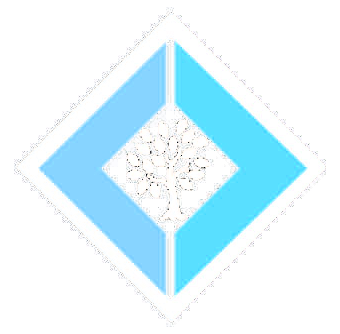
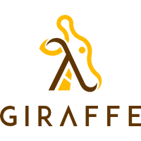
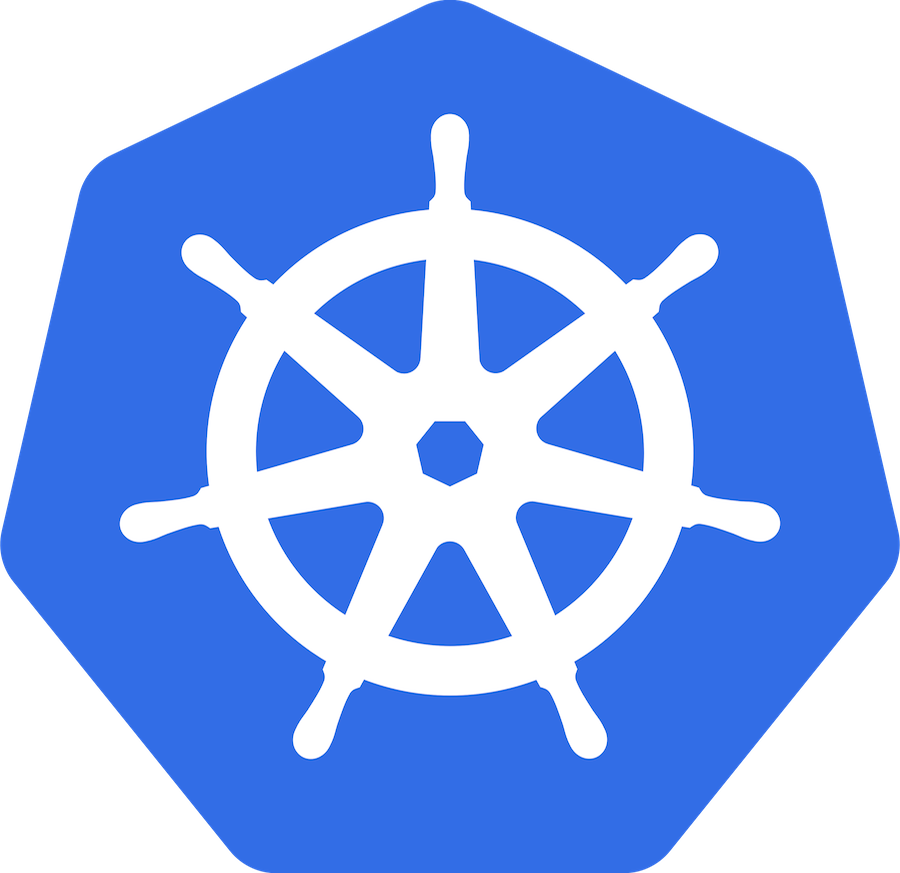
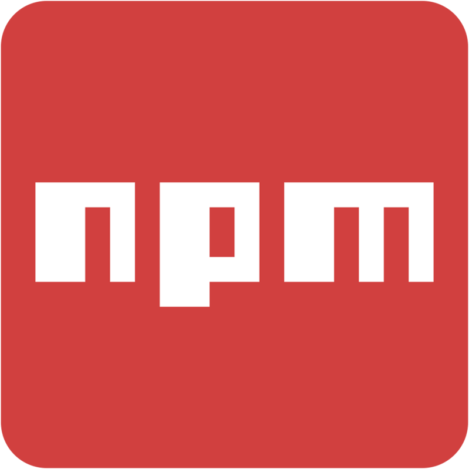

- title : SAFE Stack - current state
- description : SAFE Stack - current state
- author : Tomasz Heimowski
- theme : moon
- transition : default

***

# SAFE Stack
## current state

Tomasz Heimowski *@theimowski*

https://theimowski.com

***

# Plan

- Brief intro
- Where are we today
- How we got here
- Template deep dive
- Towards version 1.0
- What's next

***

# Brief intro

- What is SAFE?
- Quick Demo

---

# ???

---

<small>https://www.troofal.com/services/mean-stack</small>

---

<small>https://www.programmableweb.com/news/what-mean-stack-and-why-it-better-lamp/analysis/2015/12/22</small>

---

- data-background : images/4CATS.jpg

 
 
 
 
 

<h2 style="color:white">CATS</h1>
<h3 style="color:white">(Typical MS Stack)</h1>

---

## big picture

  

* Combines several OSS projects
* F# end-to-end
* Type-SAFE
* Cloud-ready
* Flexible

https://safe-stack.github.io

---

## S for Saturn

https://saturnframework.org/

* **Web server**
* ASP.NET Core, Kestrel
* MVC pattern

---

## A for Azure 

https://azure.microsoft.com

* **Cloud** provider

---

## F for Fable 

http://fable.io

* F# to **JavaScript compiler**
* Babel JS

---

## E for Elmish 

https://elmish.github.io

* **UI library**
* inspired by Elm

---

---

## Quick Demo

- Creating from scratch
- Debugging both Client & Server

---

Watch full demo from [F# eXchange '18 Video](https://skillsmatter.com/skillscasts/11308-safe-apps-with-f-web-stack)

***

# Where are we today

---

## Documentation

https://safe-stack.github.io/docs/

---

## NuGet downloads

---

## Microsoft involvement

[Phillip Carter @ F# eXchange '18](https://skillsmatter.com/skillscasts/10138-keynote-thrilled-to-have-phillip-carter-hosting-a-keynote-at-fsharpx-2018)

---

## Technology Radar

[Radar - languages and frameworks](https://www.thoughtworks.com/radar/languages-and-frameworks)

---

### Commercial support

---

## Podcasts

* [Hanselminutes - SAFE Stack with Krzysztof Cieślak](https://hanselminutes.com/624/f-and-the-functional-safe-stack-with-krzysztof-cielak)
* [.NET Rocks - SAFE Stack with Anthony Brown](https://dotnetrocks.com/?show=1626)
* [WTF# is the SAFE Stack with Isaac Abraham](https://player.fm/series/wtf-1926954/wtf-is-the-safe-stack)

---

## Events
### Conference talks

* Lambda Days 2018, Kraków, Poland
* FableConf 2018, Berlin, Germany
* F(by) 2019, Minsk, Belarus
* ...

--> https://safe-stack.github.io/docs/events/

--- 

## Events
### Workshops

* Open F# 2018, San Francisco, USA
* SAFE Hackday 2018, Birmingham, UK
* DevDays 2019, Vilnius, Lithuania
* ...

--> https://safe-stack.github.io/docs/events/

---

## Events
### Local Meetups

* Bristol, UK
* Vienna, Austria
* Prague, Czech Republic
* ...

--> https://safe-stack.github.io/docs/events/

***

# How we got here

---

## Fable

* Stable F# to JS compilation
* Reusing F# sources between front and back end

---

## Elmish

* Straight-forward & popular programming model
* Became de-facto a standard for Fable Web-based apps

---

## Announcing SAFE

* FableConf '17
* [Compositional IT Blog entry](https://compositional-it.com/blog/2017/09-22-safe-release/index.html)

---

## SAFE projects on GitHub

* [SAFE-BookStore](https://github.com/SAFE-Stack/SAFE-BookStore)
* [SAFE-Nightwatch](https://github.com/SAFE-Stack/SAFE-Nightwatch)
* [SAFE-ConfPlanner](https://github.com/SAFE-Stack/SAFE-ConfPlanner)
* [SAFE-Chat](https://github.com/SAFE-Stack/SAFE-Chat)
* [SAFE-Search](https://github.com/SAFE-Stack/SAFE-Search)

---

## SAFE template

* `dotnet new -i SAFE.Template`
* `dotnet new SAFE`
* `fake build --target run`

---

## Promotion

* https://twitter.com/safe_stack
* All the events
* Companies & community

***

# Template Deep dive

---

## Template options

* Server
* Deploy
* Layout
* JS Deps
* Communication
* Pattern

---

## Template options
### Server

 

1. Saturn
1. Giraffe
1. Suave

---

## Template options
### Deploy

 

1. Azure AppService
1. Docker
1. Google Cloud AppEngine
1. Google Cloud Kubernetes Engine

---

## Template options: layout (Fulma)

 

---

## Template options
### JS Deps

 

1. Yarn
1. NPM

---

## Template options
### Communication

* [Fable.Remoting](https://github.com/Zaid-Ajaj/Fable.Remoting)

---

## Template options
### Pattern

* [Fable.Reaction](https://github.com/dbrattli/Reaction)

---

## Template development

* Integration tests
    * Property-based for all options
    * Building new template
    * Checking HTTP response
* Pinning dependencies
    * Variance in paket.dependencies
    * Automated update

***

# Towards version 1.0

---

## 1.0 objectives

* stable dependencies
* stable CLI interface
* stable WebPack configuration
* better adoption

---

## 1.0 release

***

# What's next

- Support & fixing issues
- Extending template:
  - other platforms (mobile, desktop, iot?)
  - tests
  - more deployment options
- Keeping SAFE project "up to date"

***

# Thank you!

Slides available at

https://theimowski.com/talk-safe-current-state/index.html