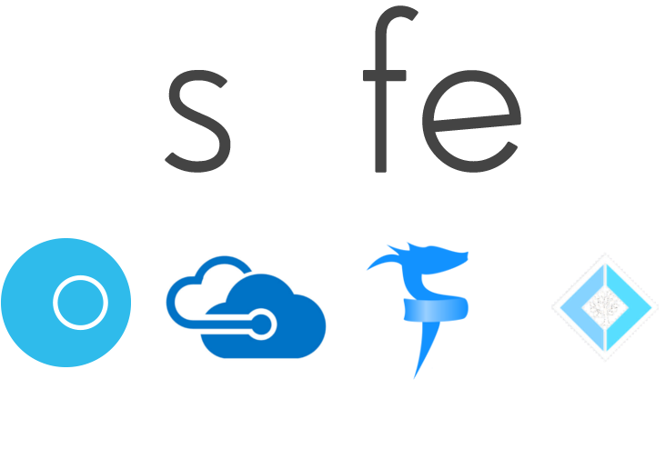

- title : SAFE Stack - current state
- description : SAFE Stack - current state
- author : Tomasz Heimowski
- theme : moon
- transition : default

***

# SAFE Stack
## current state

Tomasz Heimowski 

*@theimowski*

https://theimowski.com

***

# Plan

- Brief intro
- How we got here
- Review current state
- Towards version 1.0
- What's next

***

# Brief intro

- What is SAFE?
- Quick Demo

---

# ???

---

<small>https://www.troofal.com/services/mean-stack</small>

---

<small>https://www.programmableweb.com/news/what-mean-stack-and-why-it-better-lamp/analysis/2015/12/22</small>

---

- data-background : images/4CATS.jpg

 
 
 
 
 

<h2 style="color:white">CATS</h1>
<h3 style="color:white">(Typical MS Stack)</h1>

---

## big picture

  

* Web stack
* Combines several OSS projects
* F# end-to-end
* Type-SAFE
* Cloud-ready
* Flexible

https://safe-stack.github.io

---

## S for Saturn

https://saturnframework.org/

* **Web server**
* ASP.NET Core, Kestrel
* MVC pattern

---

## A for Azure 

https://azure.microsoft.com

* **Cloud** provider

---

## F for Fable 

http://fable.io

* F# to **JavaScript compiler**
* Babel JS

---

## E for Elmish 

https://elmish.github.io

* **UI library**
* inspired by Elm

---

---

## Quick Demo

- Creating from scratch
- Watch mode

---

## Watch full demo

[F# eXchange '18 Video](https://skillsmatter.com/skillscasts/11308-safe-apps-with-f-web-stack)

***

# How we got here

- Fable
- Announcing SAFE @ FableConf '17
- Sample projects
- SAFE template

***

# Review current state

---

## Documentation

https://safe-stack.github.io/docs/

---

## Template options

* Server
* Deploy
* Layout
* JS Deps
* Communication
* Pattern

---

## NuGet downloads

---

## Microsoft involvement

[Phillip Carter @ F# eXchange '18](https://skillsmatter.com/skillscasts/10138-keynote-thrilled-to-have-phillip-carter-hosting-a-keynote-at-fsharpx-2018)

---

## Technology Radar

[Radar - languages and frameworks](https://www.thoughtworks.com/radar/languages-and-frameworks)

---

## Commercial support

---

## Events

* Conferences
* Meetups
* Workshops
* Podcasts
  * [Hanselminutes - SAFE Stack with Krzysztof Cieślak](https://hanselminutes.com/624/f-and-the-functional-safe-stack-with-krzysztof-cielak)
  * [.NET Rocks - SAFE Stack with Anthony Brown](https://dotnetrocks.com/?show=1626)
  * [WTF# is the SAFE Stack with Isaac Abraham](https://player.fm/series/wtf-1926954/wtf-is-the-safe-stack)

--> https://safe-stack.github.io/docs/events/

***

# Towards version 1.0

- Objectives for version 1.0
- Release 1.0 live on stage
- Celebrate?

***

# What's next

- To be discussed with Isaac, Chris, Anthony, Steffen
- Support & fixing issues
- Extending template:
  - other platforms (mobile, desktop, iot)
  - tests
  - more deployment options

***

# Q&A